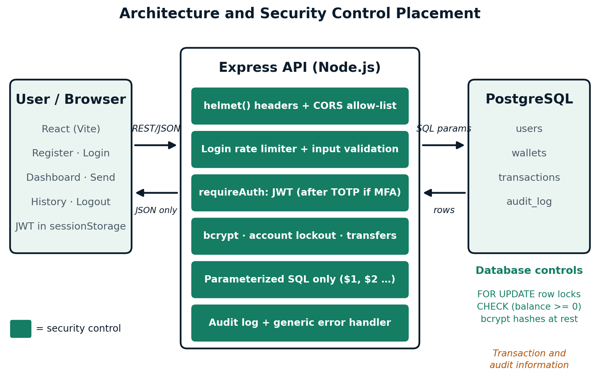

# SecureWallet — Mini Secure Fintech Wallet

A small digital-wallet web application built to demonstrate secure system design.
Stack: **React (Vite)** frontend, **Node.js / Express** API, **PostgreSQL** database.

Features: register, log in (optional TOTP multi-factor authentication), view balance,
transfer funds to another user, and view transaction history.

---

## Quick start with Docker (recommended)

You only need [Docker Desktop](https://www.docker.com/products/docker-desktop/) (or Docker Engine with the Compose plugin).
No Node.js or PostgreSQL installation is required.

```bash
git clone https://github.com/mahhnoor/SecureWallet.git
cd fintech-wallet
docker compose up --build
```

The first build takes a few minutes. When the logs show `Fintech wallet API listening on port 4000`, open:

**http://localhost:5173**

The database tables are created automatically, and two demo accounts are seeded:

| Username | Password       | Opening balance |
|----------|----------------|-----------------|
| `ali`    | `Password123!` | PKR 5,000       |
| `sara`   | `Password123!` | PKR 2,000       |

Log in as `ali` and send money to `sara` (or the other way round). You can also register a new account.

### Trying multi-factor authentication (MFA)
1. Log in as `ali` or `sara` (or your own account) and open the Dashboard.
2. Click **“2FA not enabled · Set up”**.
3. Scan the QR code with an authenticator app (Google Authenticator).
4. Enter the 6-digit code to switch MFA on.
5. Log out and log in again — after the password you will be asked for a fresh 6-digit code.

### Useful commands
| Task | Command |
|---|---|
| Start in the background | `docker compose up --build -d` |
| View logs | `docker compose logs -f backend` |
| Stop | `docker compose down` |
| Stop and **erase all data** (fresh database and demo users) | `docker compose down -v` |

### Ports and configuration
| Service | Address |
|---|---|
| Web app | http://localhost:5173 |
| API | http://localhost:4000/api (health check: `/api/health`) |
| PostgreSQL | internal only (to inspect it, uncomment the `ports` lines for `db` in `docker-compose.yml`) |

Everything has a development default, so no configuration is needed. To change a value, copy `.env.example` to `.env`
and edit it. Notes:
- `JWT_SECRET` must be at least 32 characters, otherwise the API refuses to start. The default in `docker-compose.yml` is for **development only**.
- If port 5173 or 4000 is already in use, change the left-hand number in the `ports:` entry. If you change the web port, also update `CORS_ORIGIN`; if you change the API port, also update `VITE_API_URL`, then rebuild with `docker compose up --build`.

### Troubleshooting
- **Page loads but login/register fails with a network error:** the address in the browser must match `CORS_ORIGIN` (`http://localhost:5173` or `http://127.0.0.1:5173` by default).
- **The API container keeps restarting:** run `docker compose logs backend`. The usual cause is a `JWT_SECRET` shorter than 32 characters.
- **You changed the schema or the database password and nothing happens:** the database is only initialised on its first start. Run `docker compose down -v` and start again.

---
## Architecture



*The React frontend calls the Express API, which applies security headers, CORS, rate limiting, validation, JWT/MFA authentication and parameterized queries before reaching PostgreSQL. Green boxes mark the security controls.*

## Security controls implemented (see `SEC:` comments in the code)
| Area | Control |
|---|---|
| Credentials | bcrypt hashing (cost 12); passwords are never stored or logged in plaintext |
| Multi-factor authentication | TOTP (authenticator app). A correct password alone does not issue a session token for an MFA-enabled account; a 5-minute MFA challenge must be completed first |
| Brute force | Per-IP rate limiter on `/auth/login` plus per-account lockout after 5 failed attempts |
| Authorization (IDOR) | Every query is scoped by `req.user.id` from the verified JWT, never a client-supplied id |
| Balance integrity / race conditions | Transfers run in one DB transaction with `SELECT ... FOR UPDATE` row locks, taken in a fixed order to avoid deadlocks |
| Input validation | `express-validator` allow-lists on all fields (username characters, email format, amount format and range) |
| Injection | Parameterized queries via `pg` throughout; no string-concatenated SQL |
| Information leakage | Generic error messages; identical responses for “no such user” and “wrong password”; stack traces only logged server-side |
| Sessions | 30-minute JWT with minimal claims, kept in `sessionStorage` |
| Accountability | Append-only `audit_log` table recording logins, failures, MFA enablement and transfers |
| Secure defaults | New accounts start at balance 0; DB `CHECK (balance_minor >= 0)`; the API refuses to start with a weak or missing `JWT_SECRET` |
| Transport / headers | `helmet()`, explicit CORS allow-list, JSON body size cap |
| Container hardening | The API container runs as the unprivileged `node` user; the database is not exposed to the host by default |

Known gaps are listed in the project’s *Verified Implementation Report* (e.g. no database-enforced append-only logs, no `Cache-Control` headers, no roles, no email verification).

---

## Manual setup (without Docker)

Requires Node.js 20+ and PostgreSQL 16.

### 1. Database
```bash
createdb fintech_wallet
psql -d fintech_wallet -f backend/src/db/schema.sql
```
`schema.sql` already includes the MFA columns. `backend/src/db/migrate-mfa.js` is only needed to upgrade a database that was created before MFA was added.

### 2. Backend
```bash
cd backend
cp .env.example .env      # edit .env: real DB credentials and a strong JWT_SECRET
npm install
npm run seed              # optional: demo users 'ali' and 'sara' (Password123!)
npm run dev               # http://localhost:4000
```

### 3. Frontend
```bash
cd frontend
cp .env.example .env
npm install
npm run dev               # http://localhost:5173
```

---

## Project structure
```
fintech-wallet/
├── docker-compose.yml        # runs db + backend + frontend together
├── .env.example              # optional overrides for docker-compose
├── backend/
│   ├── Dockerfile
│   └── src/
│       ├── controllers/      # auth, wallet, transactions
│       ├── middleware/       # auth, validation, rate limiting
│       ├── routes/           # Express routes
│       ├── db/               # schema.sql, pool, seed, MFA migration
│       └── utils/audit.js    # audit logging helper
└── frontend/
    ├── Dockerfile
    ├── nginx.conf
    └── src/
        ├── pages/            # Login, Register, Dashboard, Transfer, History
        ├── components/       # Layout, ProtectedRoute, PasswordField
        ├── context/          # AuthContext (JWT, current user, MFA flow)
        └── api/client.js     # axios instance that attaches the JWT
```
